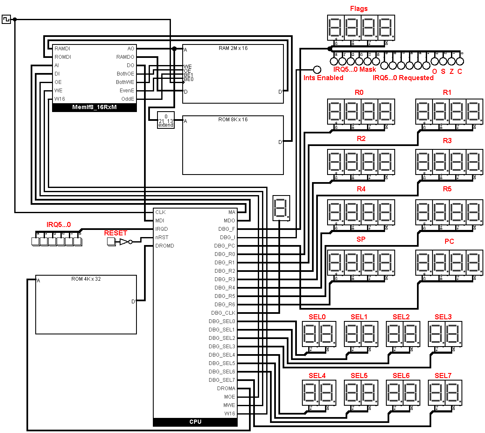

# SediCiPU 2: Proof of Concept

## Logisim-evolution project

The proof of concept is implemented as a Logisim-evolution project,
specifically, it was implemented and tested using Logisim-evolution v3.8.0.

The project implements the SediCiPU 2 CPU ([ISA](SediCiPUv2.md),
[CPU diagram](CpuDiagram.md)) and a minimum of additional circuitry, namely:
a 16KB ROM, a 4MB RAM, a reset button and 6 IRQ-triggering buttons. There's
also a 16KB decoder ROM ([decoder ROM signals](DromSignals.md)) that's
considered part of the CPU (the decoder ROM for the mini variant of the ISA
is significantly smaller, just 2KB).

The CPU is implemented mostly with Logisim-evolution's library of the 7400
series chips. The library is a bit limited, but fairly sufficient for a CPU.

## ROMs

Logisim-evolution offers loading binary files into memories as big-endian
by default. To save some GUI clicking when loading a new ROM file, you can
generate it in the big-endian byte order, despite the CPU being little-
endian.

### Decoder ROM

To create the decoder ROM you have to compile `mkdrom.c` into a program
with your C compiler and run it, something like this:

    $ gcc -std=c99 -O2 -Wall mkdrom.c -o mkdrom
    $ ./mkdrom -be drom.bin

The `-be` option makes the output file, `drom.bin`, big-endian.

### Test ROM

To create the test ROM you have to compile `mktesti.c` into a program
with your C compiler and run it, something like this:

    $ gcc -std=c99 -O2 -Wall mktesti.c -o mktesti
    $ ./mktesti -be testi.bin

The `-be` option makes the output file, `testi.bin`, big-endian.

Note that `mktesti.c` implements a rather crude but functional assembler
that emits the test code to the console in a format that is handy for
debugging, e.g.:

    ...
    mktesti.c:1810   1F58  AC48    li16(r3, 200/*00C8*/),
    mktesti.c:1810   1F5A  AE01
    mktesti.c:1811   1F5C  B02C    li16(r4, 300/*012C*/),
    mktesti.c:1811   1F5E  B202
    mktesti.c:1812   1F60  D600    lurpc(r5, 0),
    mktesti.c:1813   1F62  9E8F    addi(pc, r5, 14 + 1), // call mul sub; 60000/*EA60*/
    mktesti.c:1814   1F64  8920    expect_r16(r2, 0xEA60),
    mktesti.c:1814   1F66  AA2B
    mktesti.c:1814   1F68  E4FF
    mktesti.c:1814   1F6A  A860
    mktesti.c:1814   1F6C  ABD4
    mktesti.c:1818   1F6E  B80F    j(7), // skip over mul sub
    mktesti.c:1822   1F70  A800    li(r2, 0),
    mktesti.c:1823   1F72  A010    li(r0, 16),
    mktesti.c:1833   1F74  FEE7    add22adc33(),
    mktesti.c:1834   1F76  FEEF    cadd24(),
    mktesti.c:1835   1F78  807F    addi(r0, r0, -1),
    mktesti.c:1836   1F7A  E4FC    jnz(-4),
    mktesti.c:1839   1F7C  9E80    addi(pc, r5, 0),
    ...

You can see there the original assembly code, its line numbers in the source
file and addresses and encoded instructions in the middle columns.

## Playing with Proof of Concept

You can start the project simulation and watch the register and memory
values change during test execution. The test completes and passes
when the program counter register, `pc`, reaches the address of the
last instruction in `testi.bin`, that is, file size minus 2. If a test
check fails, the CPU enters an infinite loop in the test and the test
never completes.

The reset button resets the CPU, which amounts to disabling external/
hardware interrupts, setting the `pc` register (as well as `sel0` and
`sel4`) to 0 and beginning execution from there in the program ROM.
This is how you can restart the test.

There's no convenient way to set `pc` to an arbitrary value. But there's
a usable one... Look at the indicator connected to CPU's `DBG_CLK` output.
If it isn't zero, tick the clock one full cycle or two until `DBG_CLK`
becomes zero. When it's zero, a new instruction will be fetched next.
Edit the contents of the ROM at address `pc`/2 (the division is because
the ROM is 16-bit). Write two 16-bit hex values to the ROM: 3F80 and then
the new `pc` value. This is the `lw pc, (pc + 0)` instruction followed by
the address that it will load into `pc`. Now, tick the clock two full
cycles and observe `pc` change to the desired value. After this you can
reload the contents of the ROM from a file to undo the editing and
possibly apply any code corrections you've made.

When external/hardware interrupts are enabled (see the LED connected
to CPU's `DBG_I` output), the CPU can handle IRQs. The test will enable
interrupts at some point (near `pc` = `0x06AE`), when it has tested nearly
enough of the CPU for it to be able to handle interrupts. At that point
you can click the IRQ0...5 buttons to trigger interrupt handling.
Observe how the stack pointer register, `sp`, decrements when entering
the ISR and increments when exiting it. The ISR prioritizes the IRQs with
IRQ5 having the lowest priority and IRQ0 having the highest. If you click
IRQ0 through IRQ5 buttons in that order, IRQ0 through IRQ5 will be
handled serially. If you click IRQ5 through IRQ0 in that order quickly,
you may observe that handling of some IRQs is interrupted by handlers of
higher priority IRQs. When this happens, `sp` gets decremented to even
lower values compared to the case when there's just one outstanding IRQ
to handle.

